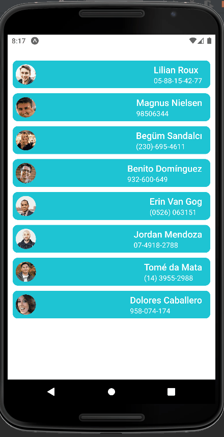

# Expo MSW 

To give support on using [MSW](https://mswjs.io/) within Expo app(s) (managed/bare) 👀.

## About
Currently, has one main screen in which it shows a list of random users, with possibility to [refresh](https://reactnative.dev/docs/refreshcontrol). 

👉 We can bring it into another dimension, like to become a useful package for Expo projects 😉.
## Demo (Android)

<details>
  <summary>Press here to expand 👈</summary>

</details>

## Usage
Make the server:
```js
const server = setupServer(...handlers);

export default server;
```

In you App.tsx (or even index file) add the following: 
```js
import "react-native-url-polyfill/auto";
import server from "./src/devServer";

server.listen({onUnhandledRequest:"bypass"});

```
👉 ``react-native-url-polyfill/auto`` is required, following [this issue in msw repository](https://github.com/mswjs/msw/issues/203#issuecomment-692550528).

## Steps to run the demo
- Clone the repo using Git command:
```
https://github.com/firas1220/expo-msw.git
```

- Install dependencies with ``yarn`` 

```
yarn install
```

or with ``npm``:  
```
npm install
```

- Run the app using Expo command:

```
expo start
```

## Supporting
We appreciate any good suggestions to make this project **community-driven**, so it becomes useful and powerful.

Especially for:
- Getting a lightweight local dev-server for mobile/web.
- Build integration tests with [Jest](https://jestjs.io/) and [RN testing library](https://callstack.github.io/react-native-testing-library/)
- Expand the showcase with more examples : 
  - [Redux (RTK Query)](https://redux-toolkit.js.org/rtk-query/overview)
  - [React Query](https://react-query-v3.tanstack.com/)

NOTE: If we get more examples, then we can turn this app into a real showcase with menus and categories and more 😎.

## Contributing
We still at the beginning 🥺! So we need some time to see if this repo is really important to others 😅.

By the way, feel free to send your pull request, if you'd like to add some features or fix an issue.

Thank you ! 🙌
